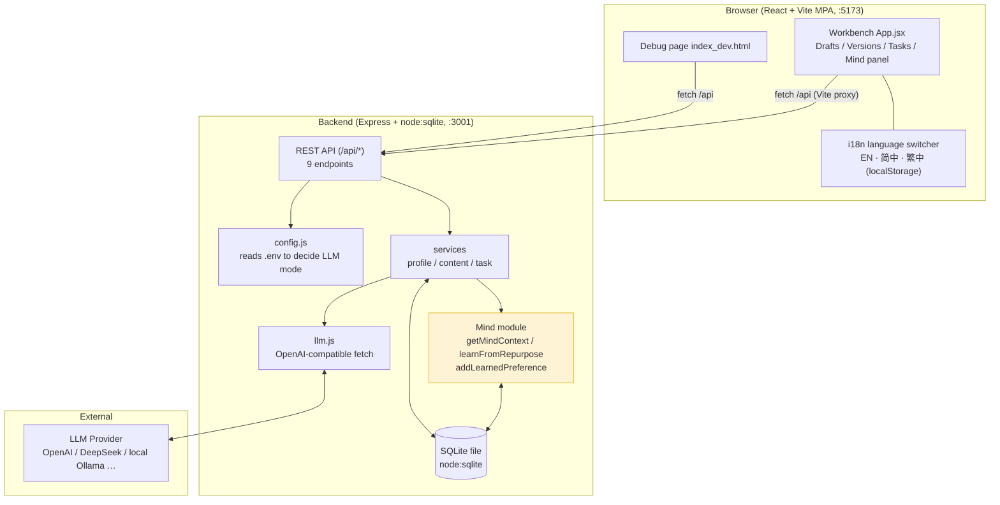
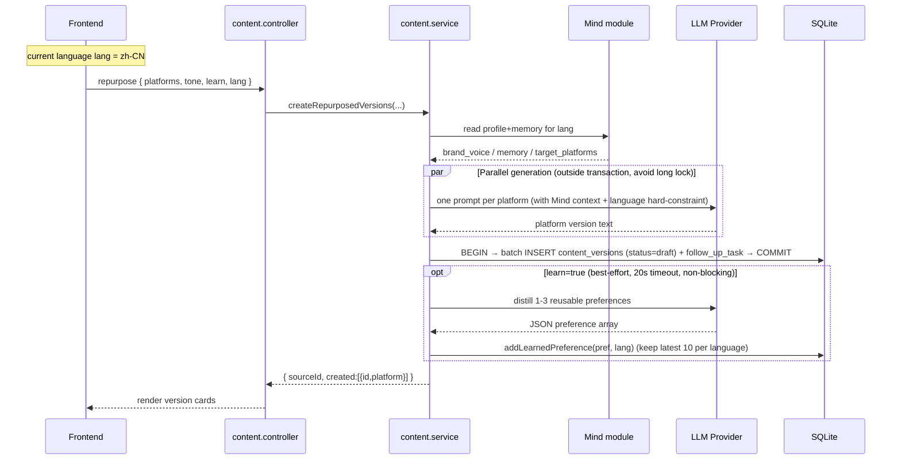
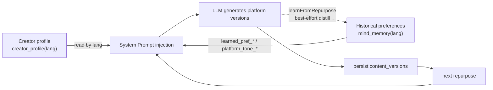

# Repurpose Mind · Architecture & Data Flow

This document explains Repurpose Mind's layered structure, the full data flow of a single "repurpose" request, and the persistent Mind (memory) loop.

---

## 1. Overall Architecture

**Key point**: The frontend only talks to `/api`; business logic lives in `services`; all DB access goes through `node:sqlite` (no ORM, no third-party DB process). The Mind module is the core differentiator: it both **reads** memory into the prompt and **writes** memory back, forming a loop.

---

## 2. Data Flow of a Single "Repurpose" Request

Using `POST /api/content/:id/repurpose` as an example:

**Key points**:
- **Generate first, then short transaction commit**: LLM calls (slow, may fail) run in parallel outside the transaction; only `INSERT` sits in `BEGIN/COMMIT`, keeping lock time minimal.
- **Fail-safe**: Errors in LLM calls or learning write-back never affect already-persisted versions; when LLM is disabled it auto-falls back to rule templates.
- **Language hard-constraint**: `lang` enters both system and user prompts so the model won't translate on its own (fixed the X-platform-english bug).

---

## 3. Persistent Mind (Memory) Loop

- **Isolation dimension**: Both `creator_profile` and `mind_memory` carry a `lang` column → three-language profiles/memory don't interfere ("isolated").
- **Persistence proof**: Memory lives in the SQLite file, surviving process restarts and sessions. `scripts/persistence-demo.mjs` verifies end-to-end: memory keys identical before/after restart, physically on disk, historical preferences injected into new generations (outputs `PASS ✅`).

---

## 4. Data Model

| Table | Key fields | Description |
|---|---|---|
| `users` | `id`, `brand_voice`, `target_platforms` | Legacy profile fields (migrated to `creator_profile`, kept for compatibility) |
| `creator_profile` | `lang`, `brand_voice`, `target_platforms` | **Per-language** creator profile, three languages seeded |
| `content_sources` | `user_id`, `title`, `original_text`, `source_type` | Source drafts (shared assets) |
| `content_versions` | `source_id`, `platform`, `version_text`, `status`, `tone` | Repurposed versions (`status`: draft/ready/published) |
| `mind_memory` | `user_id`, `key`, `value`, `lang`, `updated_at` | Long-term memory; `learned_pref_*` (auto-learned) / `platform_tone_*` (seeds) |
| `follow_up_tasks` | `user_id`, `source_id`, `task_type`, `status`, `due_at`, `note` | Todo auto-dispatched after repurpose |
| `tasks` | `task_type`, `status`, `note` | Generic todos (workbench "Todo tasks" panel) |

Migration runs **idempotently** in `db.js`: add `lang` column to `mind_memory`, backfill old data, create `creator_profile` table + indexes, seed three-language profiles — all without deleting the DB, compatible with old data.

---

## 5. Configuration & Runtime Requirements

- **Node ≥ 22**: depends on built-in `node:sqlite` and global `fetch`.
- LLM mode is decided by `LLM_API_KEY` in `server/.env`: non-empty = real call; empty = mock rule template.
- Frontend `/api` is proxied to `:3001` via Vite, so the frontend uniformly uses relative path `/api/...`.
