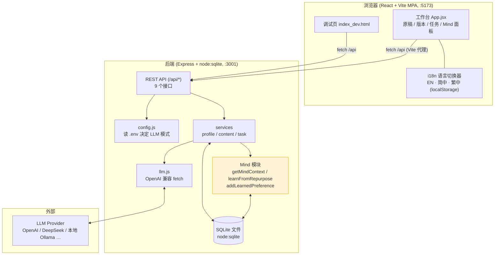
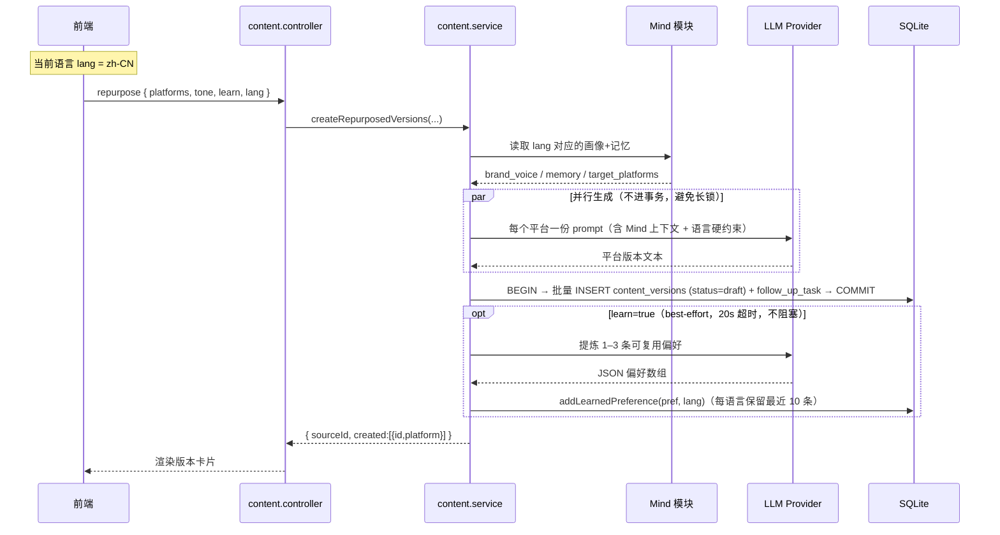
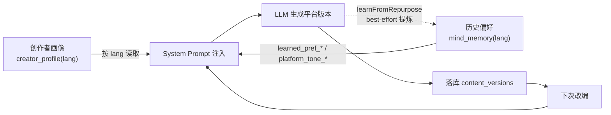

# Repurpose Mind · 架构与数据流

本文说明 Repurpose Mind 的分层结构、一次「改编」请求的完整数据流，以及持久化 Mind（记忆）闭环。

---

## 1. 总体架构

**要点**：前端只跟 `/api` 打交道；业务逻辑集中在 `services`，DB 访问全部经 `node:sqlite`（无 ORM、无第三方 DB 进程）。Mind 模块是核心差异化：它既**读**记忆注入 prompt，又**写**记忆形成闭环。

---

## 2. 一次「改编」请求的数据流

以 `POST /api/content/:id/repurpose` 为例：

**关键点**：
- **先生成、后短事务落库**：LLM 调用（慢、可能失败）放在事务外并行执行；只有 `INSERT` 在 `BEGIN/COMMIT` 里，锁时间极短。
- **失败安全**：LLM 调用或学习回写抛错都不会影响已落库的版本；未启用 LLM 时自动回落规则模板。
- **语言硬约束**：`lang` 同时进入 system 与 user prompt，模型不会擅自翻译（已修复 X 平台输出英文的问题）。

---

## 3. 持久化 Mind（记忆）闭环

- **隔离维度**：`creator_profile` 与 `mind_memory` 均带 `lang` 列 → 三语画像/记忆互不干扰（「不互通」）。
- **持久化证据**：记忆写在 SQLite 文件，进程重启、跨会话都在。`scripts/persistence-demo.mjs` 端到端验证：重启前后记忆 keys 完全一致、物理落盘、历史偏好被注入新生成（输出 `PASS ✅`）。

---

## 4. 数据模型

| 表 | 关键字段 | 说明 |
|---|---|---|
| `users` | `id`, `brand_voice`, `target_platforms` | 旧画像字段（已迁移到 `creator_profile`，保留兼容） |
| `creator_profile` | `lang`, `brand_voice`, `target_platforms` | **每语言**创作者画像，三语已 seed |
| `content_sources` | `user_id`, `title`, `original_text`, `source_type` | 原稿（共享资产） |
| `content_versions` | `source_id`, `platform`, `version_text`, `status`, `tone` | 改编版本（`status`: draft/ready/published） |
| `mind_memory` | `user_id`, `key`, `value`, `lang`, `updated_at` | 长期记忆；`learned_pref_*`（自动学习）/ `platform_tone_*`（种子） |
| `follow_up_tasks` | `user_id`, `source_id`, `task_type`, `status`, `due_at`, `note` | 改编后自动派发的待办 |
| `tasks` | `task_type`, `status`, `note` | 通用待办（工作台「待办任务」区） |

迁移在 `db.js` 中**幂等**执行：`mind_memory` 加 `lang` 列、回填旧数据、建 `creator_profile` 表与索引、seed 三语画像——全程不删库，兼容旧数据。

---

## 5. 配置与运行要求

- **Node ≥ 22**：依赖内置 `node:sqlite` 与全局 `fetch`。
- LLM 模式由 `server/.env` 的 `LLM_API_KEY` 决定：非空 = 真实调用；空 = mock 规则模板。
- 前端 `/api` 经 Vite 代理到 `:3001`，因此前端统一用相对路径 `/api/...`。
